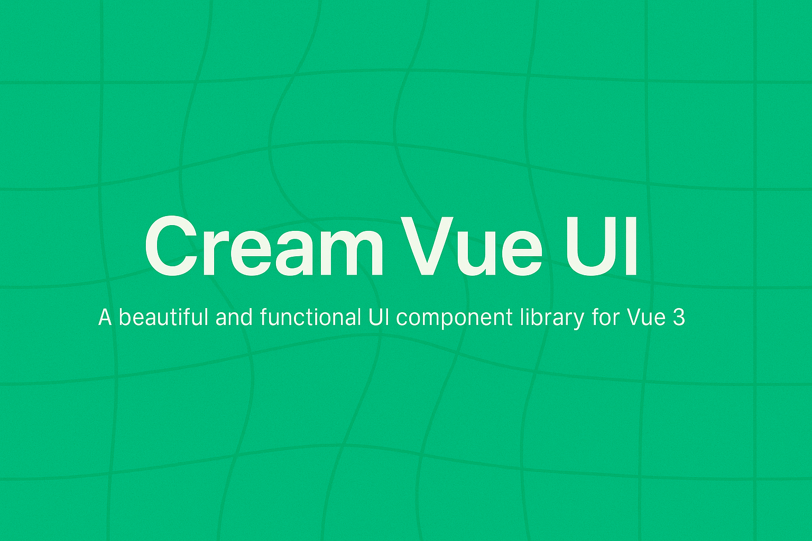

# Cream Vue UI

A beautiful and functional UI component library for Vue 3, written in JavaScript.



## Features

- 🎨 **Beautiful Design**: Modern and clean design with a focus on aesthetics
- 🧩 **Modular Components**: Use only what you need
- 🔌 **Easy to Use**: Simple API with consistent patterns
- 📱 **Responsive**: Works on all screen sizes
- 🔧 **Customizable**: Easily adapt to your brand with CSS variables
- 🚀 **Lightweight**: Minimal footprint for optimal performance

## Installation

```bash
# npm
npm install cream-vue-ui

# yarn
yarn add cream-vue-ui

# pnpm
pnpm add cream-vue-ui
```

## Usage

### Global Registration

```js
import { createApp } from 'vue'
import App from './App.vue'

// Import Cream Vue UI
import CreamVueUI from 'cream-vue-ui'
import 'cream-vue-ui/style'

// Create app and use Cream Vue UI
const app = createApp(App)
app.use(CreamVueUI)
app.mount('#app')
```

### Individual Component Registration

```js
import { createApp } from 'vue'
import App from './App.vue'

// Import individual components
import { Button, Input } from 'cream-vue-ui'
import 'cream-vue-ui/style'

// Create app and register components
const app = createApp(App)
app.component('CButton', Button)
app.component('CInput', Input)
app.mount('#app')
```

### Direct Usage in Components

```vue
<script>
import { Button, Input } from 'cream-vue-ui'
import 'cream-vue-ui/style'

export default {
  components: {
    CButton: Button,
    CInput: Input
  }
}
</script>

<template>
  <CButton>Click Me</CButton>
  <CInput placeholder="Enter your name" />
</template>
```

## Components

### Button

A versatile and beautiful button component with various styles, states, and interactive features.

#### Basic Usage

```vue
<template>
  <!-- Basic usage -->
  <CButton>Default Button</CButton>
</template>
```

#### Button Variants

```vue
<template>
  <!-- Standard Variants -->
  <CButton variant="primary">Primary</CButton>
  <CButton variant="secondary">Secondary</CButton>
  <CButton variant="success">Success</CButton>
  <CButton variant="warning">Warning</CButton>
  <CButton variant="error">Error</CButton>
  <CButton variant="info">Info</CButton>
  
  <!-- Special Variants -->
  <CButton variant="outline">Outline</CButton>
  <CButton variant="text">Text</CButton>
  <CButton variant="glass">Glass</CButton>
  <CButton variant="soft">Soft</CButton>
</template>
```

#### Button Sizes

```vue
<template>
  <CButton size="xs">Extra Small</CButton>
  <CButton size="sm">Small</CButton>
  <CButton size="md">Medium</CButton> <!-- Default -->
  <CButton size="lg">Large</CButton>
  <CButton size="xl">Extra Large</CButton>
</template>
```

#### Button States

```vue
<template>
  <!-- Disabled state -->
  <CButton disabled>Disabled Button</CButton>
  
  <!-- Loading states with different animations -->
  <CButton loading>Loading (Spinner)</CButton>
  <CButton loading loadingType="dots">Loading Dots</CButton>
  <CButton loading loadingType="pulse">Loading Pulse</CButton>
</template>
```

#### Icons and Positioning

```vue
<template>
  <!-- Icon on the left (default) -->
  <CButton icon="🚀">Left Icon</CButton>
  
  <!-- Icon on the right -->
  <CButton icon="🔍" iconPosition="right">Right Icon</CButton>
  
  <!-- Icon-only buttons -->
  <CButton icon="❤️" iconOnly></CButton>
  <CButton icon="🔔" iconOnly rounded></CButton>
</template>
```

#### Tooltips

```vue
<template>
  <!-- Button with tooltip -->
  <CButton tooltip="This is a helpful tooltip">Hover Me</CButton>
  
  <!-- Icon button with tooltip -->
  <CButton icon="❤️" iconOnly tooltip="Add to favorites"></CButton>
</template>
```

#### Elevation Levels

```vue
<template>
  <CButton elevation="none">No Shadow</CButton>
  <CButton elevation="sm">Small Shadow</CButton>
  <CButton elevation="md">Medium Shadow</CButton> <!-- Default -->
  <CButton elevation="lg">Large Shadow</CButton>
  <CButton elevation="xl">Extra Large Shadow</CButton>
</template>
```

#### Special Features

```vue
<template>
  <!-- Full width button -->
  <CButton block>Block Button</CButton>
  
  <!-- Rounded button -->
  <CButton rounded>Rounded Button</CButton>
  
  <!-- Combining multiple features -->
  <CButton 
    variant="glass" 
    icon="✨" 
    iconPosition="right" 
    rounded 
    elevation="lg"
    tooltip="Special glass button"
  >
    Glass Button
  </CButton>
</template>
```

#### Props Reference

| Prop | Type | Default | Description |
|------|------|---------|-------------|
| `variant` | String | `'primary'` | Button style variant (`primary`, `secondary`, `success`, `warning`, `error`, `info`, `outline`, `text`, `glass`, `soft`) |
| `size` | String | `'md'` | Button size (`xs`, `sm`, `md`, `lg`, `xl`) |
| `disabled` | Boolean | `false` | Disables the button |
| `loading` | Boolean | `false` | Shows a loading indicator |
| `loadingType` | String | `'spinner'` | Type of loading animation (`spinner`, `dots`, `pulse`) |
| `block` | Boolean | `false` | Makes the button full width |
| `rounded` | Boolean | `false` | Makes the button fully rounded |
| `icon` | String | `''` | Icon to display (emoji or icon font) |
| `iconPosition` | String | `'left'` | Position of the icon (`left`, `right`) |
| `iconOnly` | Boolean | `false` | Creates an icon-only button |
| `tooltip` | String | `''` | Tooltip text to display on hover |
| `elevation` | String | `'md'` | Shadow elevation level (`none`, `sm`, `md`, `lg`, `xl`) |

### Input

A flexible and beautiful input component with various styles, states, and interactive features.

#### Basic Usage

```vue
<template>
  <!-- Basic usage -->
  <CInput placeholder="Enter text" />
  
  <!-- With label -->
  <CInput label="Username" placeholder="Enter username" />
</template>
```

#### Input Variants

```vue
<template>
  <!-- Default variant -->
  <CInput label="Default" placeholder="Default variant" variant="default" />
  
  <!-- Outlined variant -->
  <CInput label="Outlined" placeholder="Outlined variant" variant="outlined" />
  
  <!-- Filled variant -->
  <CInput label="Filled" placeholder="Filled variant" variant="filled" />
  
  <!-- Underlined variant -->
  <CInput label="Underlined" placeholder="Underlined variant" variant="underlined" />
</template>
```

#### Floating Labels

```vue
<template>
  <!-- Floating label (default variant) -->
  <CInput label="Floating Label" placeholder="Type something" floatingLabel />
  
  <!-- Floating label with outlined variant -->
  <CInput 
    label="Floating Outlined" 
    placeholder="Type something" 
    floatingLabel 
    variant="outlined" 
  />
  
  <!-- Floating label with filled variant -->
  <CInput 
    label="Floating Filled" 
    placeholder="Type something" 
    floatingLabel 
    variant="filled" 
  />
</template>
```

#### Input Types

```vue
<template>
  <!-- Text input (default) -->
  <CInput type="text" label="Text" placeholder="Enter text" />
  
  <!-- Password input -->
  <CInput type="password" label="Password" placeholder="Enter password" />
  
  <!-- Email input -->
  <CInput type="email" label="Email" placeholder="Enter email" />
  
  <!-- Number input -->
  <CInput type="number" label="Number" placeholder="Enter number" />
  
  <!-- Other supported types: tel, url, search, date, time, datetime-local, month, week -->
</template>
```

#### Icons and Addons

```vue
<template>
  <!-- Left icon (default) -->
  <CInput label="Left Icon" placeholder="Search..." icon="🔍" />
  
  <!-- Right icon -->
  <CInput 
    label="Right Icon" 
    placeholder="Enter email" 
    icon="📧" 
    iconPosition="right" 
  />
  
  <!-- With prefix -->
  <CInput label="With Prefix" placeholder="Enter amount" prefix="$" />
  
  <!-- With suffix -->
  <CInput label="With Suffix" placeholder="Enter weight" suffix="kg" />
</template>
```

#### Character Count

```vue
<template>
  <!-- With character count -->
  <CInput 
    label="With Character Count" 
    placeholder="Limited to 20 characters" 
    maxLength="20" 
    showCount 
  />
</template>
```

#### Sizes

```vue
<template>
  <CInput label="Extra Small" placeholder="XS size" size="xs" />
  <CInput label="Small" placeholder="Small size" size="sm" />
  <CInput label="Medium" placeholder="Medium size" size="md" /> <!-- Default -->
  <CInput label="Large" placeholder="Large size" size="lg" />
  <CInput label="Extra Large" placeholder="XL size" size="xl" />
</template>
```

#### Elevation Levels

```vue
<template>
  <CInput label="No Shadow" elevation="none" />
  <CInput label="Small Shadow" elevation="sm" />
  <CInput label="Medium Shadow" elevation="md" />
  <CInput label="Large Shadow" elevation="lg" />
  <CInput label="Extra Large Shadow" elevation="xl" />
</template>
```

#### Special Features

```vue
<template>
  <!-- Rounded input -->
  <CInput label="Rounded Input" placeholder="With rounded corners" rounded />
  
  <!-- Clearable input -->
  <CInput label="Clearable Input" placeholder="Type to see clear button" clearable />
  
  <!-- Autofocus input -->
  <CInput label="Autofocus Input" placeholder="Automatically focused" autofocus />
</template>
```

#### States

```vue
<template>
  <!-- Disabled state -->
  <CInput label="Disabled Input" disabled placeholder="This input is disabled" />
  
  <!-- Readonly state -->
  <CInput label="Readonly Input" readonly value="This input is readonly" />
  
  <!-- Error state -->
  <CInput 
    label="With Error" 
    error="This field is required" 
    placeholder="Enter value" 
  />
  
  <!-- Success state -->
  <CInput label="Success Input" success value="Correct value" />
</template>
```

#### Props Reference

| Prop | Type | Default | Description |
|------|------|---------|-------------|
| `modelValue` | String, Number | `''` | The input value (use with v-model) |
| `type` | String | `'text'` | Input type (text, password, email, number, etc.) |
| `label` | String | `''` | Label text for the input |
| `placeholder` | String | `''` | Placeholder text |
| `variant` | String | `'default'` | Input style variant (default, outlined, filled, underlined) |
| `size` | String | `'md'` | Input size (xs, sm, md, lg, xl) |
| `disabled` | Boolean | `false` | Disables the input |
| `readonly` | Boolean | `false` | Makes the input readonly |
| `required` | Boolean | `false` | Marks the input as required |
| `error` | String | `''` | Error message to display |
| `success` | Boolean | `false` | Indicates success state |
| `icon` | String | `''` | Icon to display (emoji or icon font) |
| `iconPosition` | String | `'left'` | Position of the icon (left, right) |
| `clearable` | Boolean | `false` | Adds a clear button when input has value |
| `floatingLabel` | Boolean | `false` | Enables floating label animation |
| `rounded` | Boolean | `false` | Makes the input fully rounded |
| `prefix` | String | `''` | Text to display before the input value |
| `suffix` | String | `''` | Text to display after the input value |
| `maxLength` | Number | `null` | Maximum number of characters allowed |
| `showCount` | Boolean | `false` | Shows character count when maxLength is set |
| `autofocus` | Boolean | `false` | Automatically focuses the input on mount |
| `elevation` | String | `'none'` | Shadow elevation level (none, sm, md, lg, xl) |

### Card

A versatile and beautiful card component with various styles, layouts, and interactive features.

#### Basic Usage

```vue
<template>
  <!-- Basic usage -->
  <CCard title="Card Title" subtitle="Card Subtitle">
    <p>This is the card content.</p>
  </CCard>
  
  <!-- With footer -->
  <CCard title="Card with Footer">
    <p>Card content goes here.</p>
    <template #footer>
      <CButton variant="primary">Action</CButton>
    </template>
  </CCard>
</template>
```

#### Card Variants

```vue
<template>
  <!-- Standard variants -->
  <CCard variant="default" title="Default Card">
    <p>Default variant card.</p>
  </CCard>
  
  <CCard variant="primary" title="Primary Card">
    <p>Primary variant card.</p>
  </CCard>
  
  <CCard variant="secondary" title="Secondary Card">
    <p>Secondary variant card.</p>
  </CCard>
  
  <!-- Color variants -->
  <CCard variant="success" title="Success Card">
    <p>Success variant card.</p>
  </CCard>
  
  <CCard variant="warning" title="Warning Card">
    <p>Warning variant card.</p>
  </CCard>
  
  <CCard variant="error" title="Error Card">
    <p>Error variant card.</p>
  </CCard>
  
  <CCard variant="info" title="Info Card">
    <p>Info variant card.</p>
  </CCard>
  
  <!-- Special variants -->
  <CCard variant="outline" title="Outline Card">
    <p>Outline variant card.</p>
  </CCard>
  
  <CCard variant="flat" title="Flat Card">
    <p>Flat variant card without shadows.</p>
  </CCard>
  
  <CCard variant="glass" title="Glass Card">
    <p>Glass variant card with backdrop blur effect.</p>
  </CCard>
</template>
```

#### Cards with Images

```vue
<template>
  <!-- Top image (default) -->
  <CCard 
    title="Top Image" 
    image="https://via.placeholder.com/300x200"
    imageAlt="Card image"
  >
    <p>Card with an image at the top.</p>
  </CCard>
  
  <!-- Bottom image -->
  <CCard 
    title="Bottom Image" 
    image="https://via.placeholder.com/300x200"
    imageAlt="Card image"
    imagePosition="bottom"
  >
    <p>Card with an image at the bottom.</p>
  </CCard>
  
  <!-- Background image -->
  <CCard 
    title="Background Image" 
    image="https://via.placeholder.com/300x200"
    imageAlt="Card image"
    imagePosition="background"
  >
    <p>Card with a background image.</p>
  </CCard>
  
  <!-- Image with overlay -->
  <CCard 
    title="Image with Overlay" 
    image="https://via.placeholder.com/300x200"
    imageAlt="Card image"
    imageOverlay
  >
    <p>Card with an image overlay effect.</p>
  </CCard>
</template>
```

#### Image Aspect Ratios

```vue
<template>
  <CCard 
    title="Square Image" 
    image="https://via.placeholder.com/300x300"
    imageAlt="Square image"
    imageAspectRatio="1:1"
  >
    <p>Card with a square image (1:1 ratio).</p>
  </CCard>
  
  <CCard 
    title="4:3 Ratio" 
    image="https://via.placeholder.com/400x300"
    imageAlt="4:3 image"
    imageAspectRatio="4:3"
  >
    <p>Card with a 4:3 aspect ratio image.</p>
  </CCard>
  
  <CCard 
    title="16:9 Ratio" 
    image="https://via.placeholder.com/400x225"
    imageAlt="16:9 image"
    imageAspectRatio="16:9"
  >
    <p>Card with a 16:9 aspect ratio image.</p>
  </CCard>
  
  <CCard 
    title="21:9 Ratio" 
    image="https://via.placeholder.com/420x180"
    imageAlt="21:9 image"
    imageAspectRatio="21:9"
  >
    <p>Card with a 21:9 aspect ratio image.</p>
  </CCard>
</template>
```

#### Horizontal Layout

```vue
<template>
  <!-- Horizontal card with left image -->
  <CCard 
    title="Left Image" 
    subtitle="Horizontal card with left image"
    image="https://via.placeholder.com/300x200"
    imageAlt="Left image"
    horizontal
    imagePosition="left"
  >
    <p>This is a horizontal card with an image on the left side.</p>
  </CCard>
  
  <!-- Horizontal card with right image -->
  <CCard 
    title="Right Image" 
    subtitle="Horizontal card with right image"
    image="https://via.placeholder.com/300x200"
    imageAlt="Right image"
    horizontal
    imagePosition="right"
  >
    <p>This is a horizontal card with an image on the right side.</p>
  </CCard>
</template>
```

#### Elevation Levels

```vue
<template>
  <CCard title="No Shadow" elevation="none">
    <p>Card with no shadow.</p>
  </CCard>
  
  <CCard title="Small Shadow" elevation="sm">
    <p>Card with small shadow.</p>
  </CCard>
  
  <CCard title="Medium Shadow" elevation="md">
    <p>Card with medium shadow.</p>
  </CCard>
  
  <CCard title="Large Shadow" elevation="lg">
    <p>Card with large shadow.</p>
  </CCard>
  
  <CCard title="Extra Large Shadow" elevation="xl">
    <p>Card with extra large shadow.</p>
  </CCard>
</template>
```

#### Border Radius Options

```vue
<template>
  <CCard title="No Radius" borderRadius="none">
    <p>Card with no border radius.</p>
  </CCard>
  
  <CCard title="Small Radius" borderRadius="sm">
    <p>Card with small border radius.</p>
  </CCard>
  
  <CCard title="Default Radius" borderRadius="default">
    <p>Card with default border radius.</p>
  </CCard>
  
  <CCard title="Large Radius" borderRadius="lg">
    <p>Card with large border radius.</p>
  </CCard>
  
  <CCard title="Extra Large Radius" borderRadius="xl">
    <p>Card with extra large border radius.</p>
  </CCard>
  
  <CCard title="Full Radius" borderRadius="full">
    <p>Card with fully rounded corners.</p>
  </CCard>
</template>
```

#### Interactive Cards

```vue
<template>
  <!-- Hover effect -->
  <CCard hover title="Hover Card">
    <p>This card has a hover effect. Try hovering over it!</p>
  </CCard>
  
  <!-- Clickable card -->
  <CCard clickable title="Clickable Card" @click="handleClick">
    <p>This card is clickable. Try clicking it!</p>
  </CCard>
  
  <!-- Gradient background -->
  <CCard variant="primary" gradient title="Gradient Card">
    <p>This card has a gradient background effect.</p>
  </CCard>
</template>
```

#### Props Reference

| Prop | Type | Default | Description |
|------|------|---------|-------------|
| `title` | String | `''` | Card title |
| `subtitle` | String | `''` | Card subtitle |
| `variant` | String | `'default'` | Card style variant (default, primary, secondary, success, warning, error, info, outline, flat, glass) |
| `size` | String | `'md'` | Card size (sm, md, lg, xl) |
| `image` | String | `''` | URL of the image to display |
| `imageAlt` | String | `'Card image'` | Alt text for the image |
| `imagePosition` | String | `'top'` | Position of the image (top, bottom, left, right, background) |
| `imageOverlay` | Boolean | `false` | Adds an overlay gradient effect to the image |
| `imageAspectRatio` | String | `'auto'` | Aspect ratio of the image (auto, 1:1, 4:3, 16:9, 21:9) |
| `horizontal` | Boolean | `false` | Makes the card layout horizontal |
| `hover` | Boolean | `false` | Adds hover effect to the card |
| `clickable` | Boolean | `false` | Makes the card clickable |
| `elevation` | String | `'sm'` | Shadow elevation level (none, sm, md, lg, xl) |
| `borderRadius` | String | `'default'` | Border radius size (none, sm, default, lg, xl, full) |
| `gradient` | Boolean | `false` | Adds a gradient background effect |

### Alert

A versatile and beautiful alert component with various styles, animations, and interactive features.

#### Basic Usage

```vue
<template>
  <!-- Basic usage -->
  <CAlert>This is a default info alert.</CAlert>
  
  <!-- With title -->
  <CAlert title="Alert Title">This is an alert with a title.</CAlert>
</template>
```

#### Alert Types

```vue
<template>
  <CAlert type="info" title="Info">This is an info alert.</CAlert>
  <CAlert type="success" title="Success">This is a success alert.</CAlert>
  <CAlert type="warning" title="Warning">This is a warning alert.</CAlert>
  <CAlert type="error" title="Error">This is an error alert.</CAlert>
</template>
```

#### Alert Variants

```vue
<template>
  <!-- Default variant -->
  <CAlert title="Default Variant" type="info" variant="default">
    This is the default variant of an alert.
  </CAlert>
  
  <!-- Filled variant -->
  <CAlert title="Filled Variant" type="success" variant="filled">
    This is a filled variant with solid background color.
  </CAlert>
  
  <!-- Soft variant -->
  <CAlert title="Soft Variant" type="warning" variant="soft">
    This is a soft variant with a subtle background color.
  </CAlert>
  
  <!-- Toast variant -->
  <CAlert title="Toast Variant" type="error" variant="toast">
    This is a toast notification variant.
  </CAlert>
</template>
```

#### Border Styles

```vue
<template>
  <CAlert title="Left Border" type="info" border="left">
    This alert has a left border.
  </CAlert>
  
  <CAlert title="Top Border" type="success" border="top">
    This alert has a top border.
  </CAlert>
  
  <CAlert title="Right Border" type="warning" border="right">
    This alert has a right border.
  </CAlert>
  
  <CAlert title="Bottom Border" type="error" border="bottom">
    This alert has a bottom border.
  </CAlert>
  
  <CAlert title="All Borders" type="info" border="all">
    This alert has borders on all sides.
  </CAlert>
</template>
```

#### Icon Positions

```vue
<template>
  <!-- Left icon (default) -->
  <CAlert title="Left Icon" type="info" iconPosition="left">
    This alert has an icon on the left.
  </CAlert>
  
  <!-- Right icon -->
  <CAlert title="Right Icon" type="success" iconPosition="right">
    This alert has an icon on the right.
  </CAlert>
  
  <!-- Top icon -->
  <CAlert title="Top Icon" type="warning" iconPosition="top">
    This alert has an icon at the top.
  </CAlert>
  
  <!-- Custom icon -->
  <CAlert title="Custom Icon" type="error" icon="🔔">
    This alert has a custom icon.
  </CAlert>
  
  <!-- No icon -->
  <CAlert title="No Icon" type="info" :showIcon="false">
    This alert has no icon.
  </CAlert>
</template>
```

#### Dismissible Alerts

```vue
<template>
  <!-- Dismissible alert -->
  <CAlert 
    title="Dismissible Alert" 
    type="info" 
    dismissible
    @dismiss="handleDismiss"
  >
    This alert can be dismissed by clicking the X button.
  </CAlert>
  
  <!-- With custom close icon -->
  <CAlert 
    title="Custom Close Icon" 
    type="warning" 
    closable
    closeIcon="✖"
    @dismiss="handleDismiss"
  >
    This alert has a custom close icon.
  </CAlert>
</template>
```

#### Auto-Close Alerts

```vue
<template>
  <!-- Auto-close after 5 seconds -->
  <CAlert 
    title="Auto-Close Alert" 
    type="info" 
    :autoClose="5000"
  >
    This alert will automatically close after 5 seconds.
  </CAlert>
</template>
```

#### Alerts with Actions

```vue
<template>
  <!-- With action buttons -->
  <CAlert 
    title="With Actions" 
    type="info"
    :actions="[
      { label: 'Confirm', variant: 'primary' },
      { label: 'Cancel', text: true }
    ]"
  >
    This alert has action buttons.
  </CAlert>
  
  <!-- With dismiss action -->
  <CAlert 
    title="Dismissible with Actions" 
    type="warning"
    :actions="[
      { label: 'Learn More', variant: 'primary' },
      { label: 'Dismiss', text: true, close: true }
    ]"
  >
    This alert has action buttons, including one that dismisses the alert.
  </CAlert>
</template>
```

#### Elevation Levels

```vue
<template>
  <CAlert title="No Shadow" type="info" elevation="none">
    This alert has no shadow.
  </CAlert>
  
  <CAlert title="Small Shadow" type="success" elevation="sm">
    This alert has a small shadow.
  </CAlert>
  
  <CAlert title="Medium Shadow" type="warning" elevation="md">
    This alert has a medium shadow.
  </CAlert>
  
  <CAlert title="Large Shadow" type="error" elevation="lg">
    This alert has a large shadow.
  </CAlert>
  
  <CAlert title="Extra Large Shadow" type="info" elevation="xl">
    This alert has an extra large shadow.
  </CAlert>
</template>
```

#### Sizes

```vue
<template>
  <CAlert title="Small Alert" type="info" size="sm">
    This is a small alert.
  </CAlert>
  
  <CAlert title="Medium Alert" type="success" size="md">
    This is a medium alert (default).
  </CAlert>
  
  <CAlert title="Large Alert" type="warning" size="lg">
    This is a large alert.
  </CAlert>
</template>
```

#### Special Styles

```vue
<template>
  <!-- Outlined style -->
  <CAlert title="Outlined Alert" type="info" outlined>
    This is an outlined alert.
  </CAlert>
  
  <!-- Non-rounded alert -->
  <CAlert title="Non-Rounded Alert" type="success" :rounded="false">
    This alert has no rounded corners.
  </CAlert>
  
  <!-- Toast positioning -->
  <CAlert 
    title="Top Right Toast" 
    type="info" 
    variant="toast" 
    position="top-right"
  >
    This is a toast notification positioned at the top right.
  </CAlert>
</template>
```

#### Props Reference

| Prop | Type | Default | Description |
|------|------|---------|-------------|
| `title` | String | `''` | Alert title |
| `type` | String | `'info'` | Alert type (info, success, warning, error) |
| `variant` | String | `'default'` | Alert style variant (default, filled, soft, toast) |
| `size` | String | `'md'` | Alert size (sm, md, lg) |
| `dismissible` | Boolean | `false` | Makes the alert dismissible with a close button |
| `closable` | Boolean | `false` | Alternative prop for dismissible (for consistency) |
| `closeIcon` | String | `'×'` | Custom close button icon |
| `icon` | String | `''` | Custom icon to display |
| `showIcon` | Boolean | `true` | Controls whether to show the icon |
| `iconPosition` | String | `'left'` | Position of the icon (left, right, top) |
| `border` | String | `'none'` | Border style (none, left, top, right, bottom, all) |
| `rounded` | Boolean | `true` | Controls whether the alert has rounded corners |
| `outlined` | Boolean | `false` | Makes the alert outlined instead of filled |
| `elevation` | String | `'none'` | Shadow elevation level (none, sm, md, lg, xl) |
| `autoClose` | Number | `0` | Auto-close timeout in milliseconds (0 = disabled) |
| `actions` | Array | `[]` | Array of action button objects |
| `position` | String | `'static'` | Position for toast notifications (static, top-right, top-left, bottom-right, bottom-left, top-center, bottom-center) |

## License

[MIT](LICENSE)
# CreamVueUi


